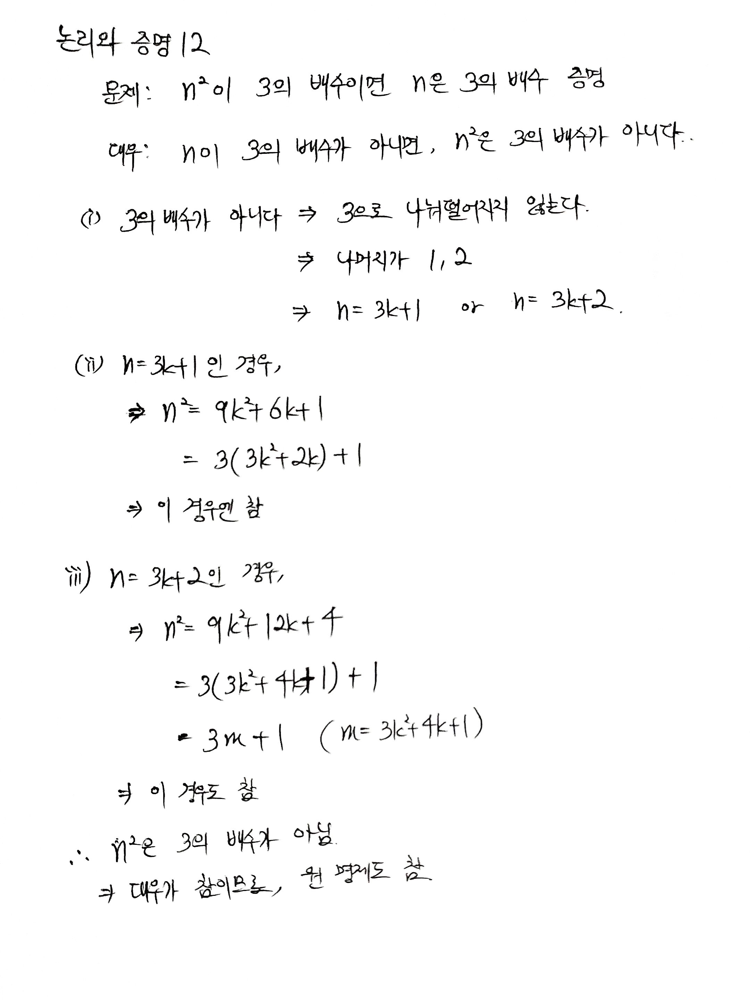
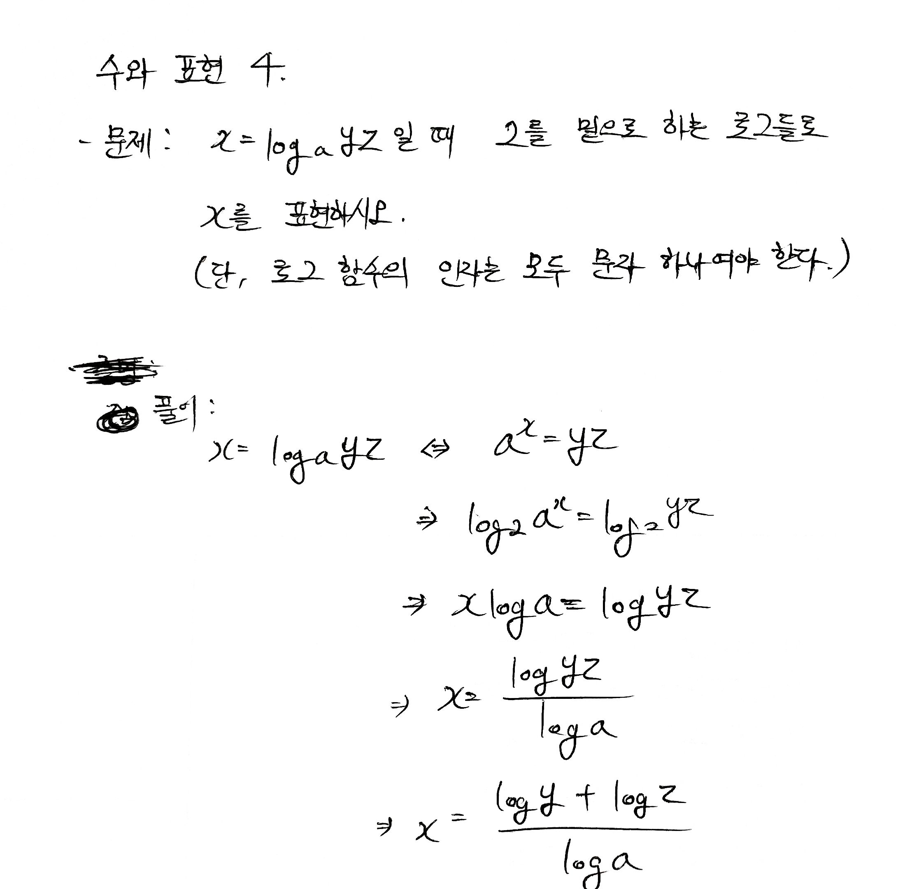
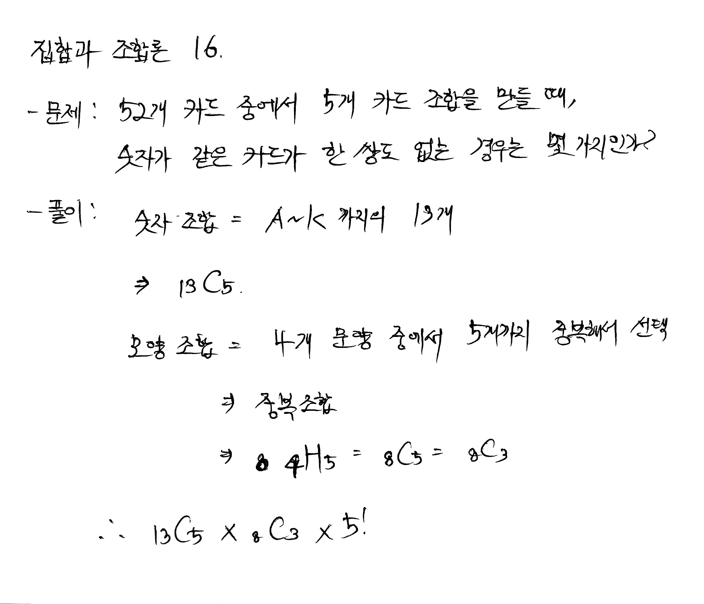

### 논리와 증명 12 

\- 문제 12: n^2이 3의 배수이면 n은 3의 배수임을 증명하라.

### 수와표현 4

\- 문제 4: x=log_a⁡yz일 때 x를 2를 밑으로 하는 로그들로 표현하시오. 단, 로그 함수의 인자는 모두 문자 하나여야 한다.

### 집합과 조합론 16

\- 문제 16: 52개 카드에서 5개 카드 조합을 만들 때, 숫자가 같은 카드가 한 쌍도 없는 경우는 몇가지인가?

